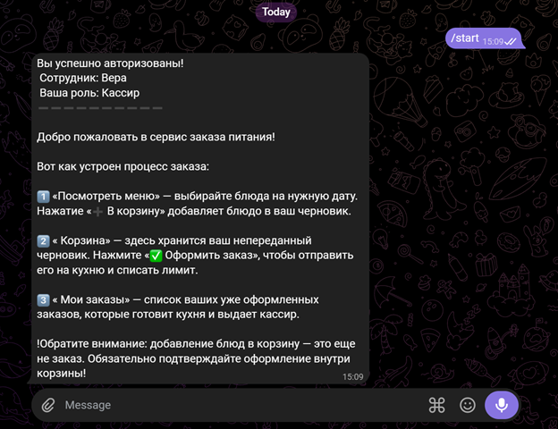
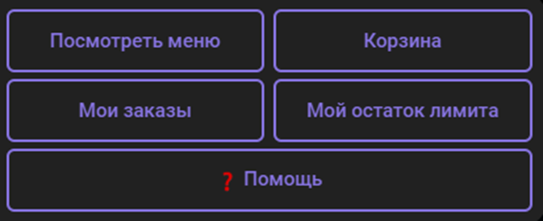
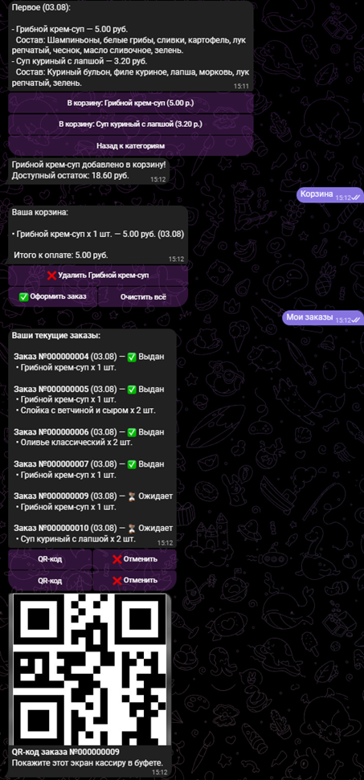
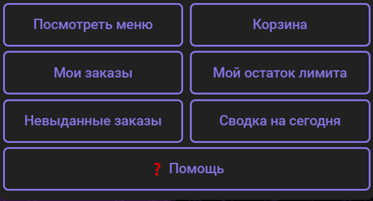
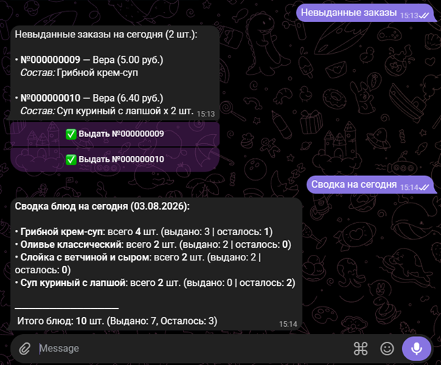

# 1C-telegram-catering
Интеграция Telegram-бота с 1С:Предприятие 8.3 для автоматизации заказа обедов, контроля дневных лимитов питания сотрудников и подтверждения выдачи заказов кассиром

> **📌 О проекте:**  
> Данный репозиторий представляет собой **пет-проект**, разработанный на **чистой (нетиповой) конфигурации** «1С:Предприятие 8.3». Архитектура подсистем и сервисных модулей спроектирована с учетом возможной будущей бесшовной интеграции в типовые решения 1С в виде отдельной подсистемы или расширения (`.cfe`).

---

Система охватывает весь цикл обслуживания: от просмотра меню и заказа блюд в рамках персонального дневного лимита до двухрежимного поиска и выдачи заказов на кассе (ручной поиск или сканирование QR-кодов).

**Бизнес-ценность решения:**
* **Автоматизация заказов:** Исключает ручной сбор заявок и бумажный документооборот.
* **Финансовый контроль:** Блокирует добавление блюд при превышении лимита в режиме реального времени, исключая уход остатка в минус.
* **Ускорение работы кассира:** Позволяет моментально выдать заказ по QR-коду или найти его по номеру/фамилии сотрудника.

---

## Архитектура и технические решения

При проектировании упор сделан на разделение клиент-серверной логики, безопасность хранения конфиденциальных данных и удобство работы кассира.

### 1. Безопасность и интеграционный слой (Telegram Bot API)

* **Хранение секретов в константах:** Токен Telegram-бота вынесен в константу 1С (`Константы.ТокенTelegramБота`), что полностью исключает попадание чувствительных данных в исходный код конфигурации (`.cf`).
* **Прямое HTTPS-взаимодействие:** Использование объектов `HTTPСоединение` и `HTTPЗапрос` с поддержкой OpenSSL (`ЗащищенноеСоединениеOpenSSL`) без использования сторонних внешних библиотек.
* **Формирование изображений (QR-коды):** Динамическая интеграция с генератором QR-кодов для отправки графических карт заказов пользователям (`sendPhoto`).

### 2. Моделирование данных и регистры сведений

* **Регистр сведений `МенюНаДень`:** Служит источником данных для Telegram-бота. Хранит расписание блюд на выбранные даты с привязкой к номенклатуре, ценам, категориям, составу и признаку активности.
* **Регистр сведений `КорзиныСотрудников`:** Предназначен для промежуточного хранения позиций, выбранных пользователем в боте, до момента финального подтверждения заказа и создания документа `ЗаказНаПитание`.

### 3. Ролевая модель и разграничение прав

Логика бота и интерфейсы разграничены в зависимости от роли пользователя:
* **Сотрудник:** Взаимодействует с системой **исключительно через интерфейс Telegram-бота**. Доступные функции: просмотр меню, наполнение корзины, отмена заказов до дедлайна и генерация персонального QR-кода для получения.
* **Кассир:** Имеет доступ к служебным командам в боте и рабочему месту кассира. Доступные функции: просмотр списка невыданных заказов на сегодня, быстрый поиск заказов и проведение выдачи (ручное или по QR-коду).
* **Администратор:** Обладает полными правами в системе: управление каталогом меню, просмотр сводок по блюдам, административные настройки и управление пользователями.

### 4. Управление корзиной и контроль дневных лимитов

* **Жесткая валидация до добавления в ТЧ:** Проверка доступного остатка дневного лимита выполняется *до* записи позиции в корзину (`КорзиныСотрудников`). При недостатке средств операция прерывается с выводом информационного сообщения.
* **Категоризированное интерактивное меню:** Выгрузка меню на выбранную дату из регистра сведений `МенюНаДень` с выводом цен, состава и генерацией динамических кнопок (`inline_keyboard`).

### 5. Двухрежимное рабочее место кассира

* **Выдача по QR-коду:** Кассир сканирует QR-код с экрана телефона сотрудника (префикс `ORDER_`), и бот автоматически проводит документ и уведомляет сотрудника.
* **Ручной детальный поиск:** Поиск невыданных заказов по фрагменту номера или фамилии. Функция поиска возвращает агрегированную карточку заказа (полный состав, количество порций и итоговую сумму).
* **Защита от повторной выдачи:** Проверка реквизита `ЗаказЗабран` с предупреждением кассира, если заказ уже был получен.

---

## Демонстрация работы и интерфейс

### 1. Начало работы с ботом
Стартовое сообщение и приветствие пользователя в боте.

### 2. Интерфейс сотрудника
Просмотр доступных категорий меню, выбор блюд и добавление их в корзину.

### 3. Оформление заказа
Просмотр содержимого корзины, проверка лимитов и подтверждение заказа.

### 4. Интерфейс кассира
Меню специализированных команд для сотрудника с ролью кассира.

### 5. Выдача заказов и отчет кассира
Поиск не выданных заказов, проверка состава и подтверждение выдачи.

---

## Структура репозитория

* `1C-telegram-catering.cf` — файл конфигурации 1С:Предприятие 8.3 (без данных ИБ и без токена бота).
* `README.md` — документация к проекту.

---

## Установка и развертывание

### Системные требования:
* Платформа **1С:Предприятие 8.3** (управляемое приложение).
* Доступ сервера/клиента 1С к сети Интернет по протоколу HTTPS (порт 443).
* Токен Telegram-бота (полученный через `@BotFather`).

### Порядок настройки:
1. Загрузите файл конфигурации `1C-telegram-catering.cf` в вашу информационную базу через Конфигуратор (`Конфигурация` -> `Загрузить конфигурацию из файла...`).
2. Запустите 1С в режиме **1С:Предприятие**.
3. Укажите токен бота через **Функции для специалиста** -> **Константы** -> **ТокенTelegramБота** (или выполните команду в Табло: `Константы.ТокенTelegramБота.Установить("ВАШ_ТОКЕН");`).
4. В справочнике `Сотрудники` заполните реквизиты:
   * `TelegramID` — ID чата сотрудника в Telegram.
   * `ДневнойЛимит` — сумма дневного лимита на питание в рублях.
   * `Роль` — назначьте роль (`Сотрудник`, `Кассир`, `Администратор`).
5. Заполните регистр сведений `МенюНаДень` актуальными позициями номенклатуры.
